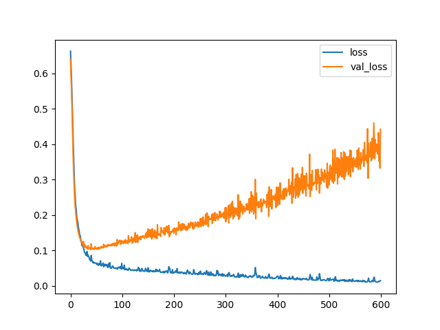

# Cancer Model 🤖

> Model that predicts if a tumor is malign or benign based on exams data.

## Goals

The goal with this model is to apply techniques to avoid the data over fitting.
The plot bellow is an example that our model got too many epochs causing the
over fitting issue:



## Results

The over fitting could be minimized using two strategies:

1. Using an **early stop** callback that will stop the
training if the `loss` and `val_loss` starts to spread out.
2. Adding drop out layers to turn off a percentage of neurons
randomly on each batch of training.

Applying both we could get this result:


### Confusion matrix

```shell
[[54  1]
 [ 4 84]]
```

### Classification report

```shell
              precision    recall  f1-score   support

           0       0.93      0.98      0.96        55
           1       0.99      0.95      0.97        88

    accuracy                           0.97       143
   macro avg       0.96      0.97      0.96       143
weighted avg       0.97      0.97      0.97       143
```

## Train/Test data analytics

> Count how many are benign an malign


> Correlation bar


> Correlation heat map


## Running

To run the model first create a new Python environment and activate it. I'm using [Anaconda](https://www.anaconda.com/) for that. The command bellow will
automatically setup the environment with conda and pipenv:

```shell
make env
```

Now install all the project dependencies:

```shell
make install-all
```

And run the model:

```shell
make model
```

After running you model, it will be saved inside `storage/cancer-model.keras`.
To just run your recent created model and predict a random value from our data set,
use the following script:

```shell
make predict 
```

Remember that for this to work, you need to run `make model` first to create your model.
